# DayByDay Automotive — Database ERD

Entity-Relationship diagram for the Automotive Spare Parts POS & Inventory
Management System (Laravel 10).

**Legend:** `PK` = primary key, `FK` = foreign key, `UK` = unique, enum allowed
values shown in quotes. Polymorphic relationships (location / source /
destination / reference / approvable / auditable) are drawn to each possible
target and labelled `«morph»`.

```mermaid
erDiagram
    %% ===================== ACCESS CONTROL =====================
    USERS {
        bigint id PK
        string name
        string email UK
        string phone
        string password
        boolean is_active
        datetime last_login_at
        bigint shop_id FK
        bigint warehouse_id FK
        datetime deleted_at
    }
    ROLES {
        bigint id PK
        string name
        string guard_name
    }
    PERMISSIONS {
        bigint id PK
        string name
        string guard_name
    }
    USER_LOGINS {
        bigint id PK
        bigint user_id FK
        string ip_address
        text user_agent
        datetime logged_in_at
        datetime logged_out_at
    }

    %% ===================== MASTER DATA =====================
    WAREHOUSES {
        bigint id PK
        string name
        string code UK
        string address
        string phone
        boolean is_active
        datetime deleted_at
    }
    SHOPS {
        bigint id PK
        string name
        string code UK
        string address
        string phone
        boolean is_active
        datetime deleted_at
    }
    SUPPLIERS {
        bigint id PK
        string name
        string code UK
        string contact_person
        string phone
        string email
        string country
        char currency
        smallint lead_time_days
        decimal rating
        boolean is_active
        datetime deleted_at
    }
    VEHICLE_MAKES {
        bigint id PK
        string name UK
        boolean is_active
        datetime deleted_at
    }
    VEHICLE_MODELS {
        bigint id PK
        bigint vehicle_make_id FK
        string name
        boolean is_active
        datetime deleted_at
    }
    CATEGORIES {
        bigint id PK
        string name
        bigint parent_id FK
        boolean is_active
        datetime deleted_at
    }
    PRODUCT_NAMES {
        bigint id PK
        string name UK
        boolean is_active
        datetime deleted_at
    }
    UNITS {
        bigint id PK
        string name UK
        string abbreviation
        boolean is_active
        datetime deleted_at
    }
    PRODUCTS {
        bigint id PK
        string part_number UK
        string name
        bigint product_name_id FK
        bigint vehicle_make_id FK
        bigint vehicle_model_id FK
        bigint category_id FK
        bigint unit_id FK
        bigint supplier_id FK
        decimal cost_price
        decimal selling_price
        int reorder_level
        string barcode UK
        text description
        boolean is_active
        datetime deleted_at
    }
    PRODUCT_VEHICLE_MODEL {
        bigint id PK
        bigint product_id FK
        bigint vehicle_model_id FK
    }

    %% ===================== INVENTORY =====================
    STOCK_LEDGER {
        bigint id PK
        bigint product_id FK
        string location_type
        bigint location_id
        enum transaction_type "opening_balance,purchase_receipt,transfer_out,transfer_in,sale,customer_return,supplier_return,adjustment"
        decimal quantity "signed"
        decimal unit_cost
        decimal balance_after
        string reference_type
        bigint reference_id
        string reference_number
        bigint user_id FK
        text notes
    }
    STOCK_BALANCES {
        bigint id PK
        bigint product_id FK
        string location_type
        bigint location_id
        decimal quantity_on_hand
        decimal quantity_reserved
        decimal quantity_available "generated"
        decimal average_cost
    }
    STOCK_ADJUSTMENTS {
        bigint id PK
        string adjustment_number UK
        string location_type
        bigint location_id
        enum reason "damaged,lost,count_variance,correction,other"
        enum status "draft,pending,approved,rejected"
        text notes
        bigint created_by FK
        bigint approved_by FK
        datetime approved_at
        datetime deleted_at
    }
    STOCK_ADJUSTMENT_ITEMS {
        bigint id PK
        bigint stock_adjustment_id FK
        bigint product_id FK
        decimal system_quantity
        decimal counted_quantity
        decimal difference
        decimal unit_cost
    }

    %% ===================== PROCUREMENT =====================
    PROCUREMENT_FOLDERS {
        bigint id PK
        string folder_number UK
        bigint supplier_id FK
        char currency
        decimal exchange_rate
        string import_type
        enum status "draft,cost_analysis,pending_approval,approved,po_generated,in_transit,received,closed,cancelled"
        text notes
        decimal total_cost
        decimal total_freight
        decimal total_tax
        decimal total_landing_cost
        bigint created_by FK
        bigint approved_by FK
        datetime approved_at
        datetime closed_at
        datetime deleted_at
    }
    PROCUREMENT_ITEMS {
        bigint id PK
        bigint procurement_folder_id FK
        bigint product_id FK
        decimal quantity
        decimal unit_cost
        decimal cbm
        decimal freight_charge
        decimal tax_cost
        decimal total_cost
        decimal landing_cost
        decimal cost_per_unit
        decimal margin
        decimal recommended_selling_price
    }
    PURCHASE_ORDERS {
        bigint id PK
        string po_number UK
        bigint procurement_folder_id FK
        bigint supplier_id FK
        enum status "draft,sent,partially_received,received,cancelled"
        enum delivery_status "pending,in_transit,delivered"
        date order_date
        date expected_date
        char currency
        decimal total
        text notes
        bigint created_by FK
        datetime deleted_at
    }
    PURCHASE_ORDER_ITEMS {
        bigint id PK
        bigint purchase_order_id FK
        bigint product_id FK
        decimal quantity
        decimal unit_cost
        decimal received_quantity
        decimal line_total
    }
    GOODS_RECEIPT_NOTES {
        bigint id PK
        string grn_number UK
        bigint purchase_order_id FK
        bigint procurement_folder_id FK
        bigint warehouse_id FK
        bigint received_by FK
        datetime received_at
        text notes
    }
    GOODS_RECEIPT_NOTE_ITEMS {
        bigint id PK
        bigint goods_receipt_note_id FK
        bigint product_id FK
        decimal expected_quantity
        decimal received_quantity
        decimal damaged_quantity
        decimal unit_cost
    }

    %% ===================== DISTRIBUTION / TRANSFERS =====================
    TRANSFER_REQUESTS {
        bigint id PK
        string request_number UK
        enum type "warehouse_to_shop,inter_shop"
        string source_type
        bigint source_id
        string destination_type
        bigint destination_id
        enum status "draft,pending,approved,rejected,returned,dispatched,completed,cancelled"
        bigint requested_by FK
        bigint approved_by FK
        datetime approved_at
        text notes
        datetime deleted_at
    }
    TRANSFER_REQUEST_ITEMS {
        bigint id PK
        bigint transfer_request_id FK
        bigint product_id FK
        decimal requested_quantity
        decimal approved_quantity
    }
    STOCK_TRANSFERS {
        bigint id PK
        string transfer_number UK
        bigint transfer_request_id FK
        string source_type
        bigint source_id
        string destination_type
        bigint destination_id
        enum status "dispatched,in_transit,received,closed,cancelled"
        bigint dispatched_by FK
        datetime dispatched_at
        bigint received_by FK
        datetime received_at
        text notes
        datetime deleted_at
    }
    STOCK_TRANSFER_ITEMS {
        bigint id PK
        bigint stock_transfer_id FK
        bigint product_id FK
        decimal dispatched_quantity
        decimal received_quantity
        decimal damaged_quantity
    }

    %% ===================== SALES & RETURNS =====================
    SALES {
        bigint id PK
        string receipt_number UK
        bigint shop_id FK
        bigint user_id FK
        string customer_name
        string customer_phone
        decimal subtotal
        decimal discount_total
        decimal tax_total
        decimal total
        decimal amount_paid
        decimal change_due
        enum status "held,completed,reversed"
        enum payment_status "unpaid,partial,paid"
        datetime sold_at
        bigint reversed_by FK
        datetime reversed_at
        text notes
        datetime deleted_at
    }
    SALE_ITEMS {
        bigint id PK
        bigint sale_id FK
        bigint product_id FK
        decimal quantity
        decimal unit_price
        decimal discount
        decimal line_total
    }
    PAYMENTS {
        bigint id PK
        bigint sale_id FK
        enum method "cash,mpesa,bank_transfer,card"
        decimal amount
        string reference
        datetime paid_at
        bigint received_by FK
    }
    RETURNS {
        bigint id PK
        string return_number UK
        enum type "customer,supplier"
        bigint sale_id FK
        bigint supplier_id FK
        bigint shop_id FK
        bigint warehouse_id FK
        string reason
        enum status "pending,approved,rejected,completed"
        decimal refund_amount
        bigint processed_by FK
        bigint approved_by FK
        datetime approved_at
        datetime deleted_at
    }
    RETURN_ITEMS {
        bigint id PK
        bigint return_id FK
        bigint product_id FK
        decimal quantity
        decimal unit_price
        enum condition "good,damaged"
        boolean restock
        boolean replacement
    }

    %% ===================== SYSTEM =====================
    APPROVALS {
        bigint id PK
        string approvable_type
        bigint approvable_id
        enum status "pending,approved,rejected,returned"
        bigint requested_by FK
        bigint current_approver_id FK
        datetime completed_at
        text notes
    }
    APPROVAL_ACTIONS {
        bigint id PK
        bigint approval_id FK
        bigint actor_id FK
        enum action "approved,rejected,returned,commented"
        text comments
    }
    AUDIT_LOGS {
        bigint id PK
        bigint user_id FK
        string action
        string module
        string auditable_type
        bigint auditable_id
        string reference_number
        json old_values
        json new_values
        string ip_address
        text user_agent
    }
    NOTIFICATIONS {
        uuid id PK
        string type
        string notifiable_type
        bigint notifiable_id
        text data
        datetime read_at
    }

    %% ===================== RELATIONSHIPS =====================
    SHOPS ||--o{ USERS : "assigned to"
    WAREHOUSES ||--o{ USERS : "assigned to"
    USERS ||--o{ USER_LOGINS : "logs"
    USERS }o--o{ ROLES : "model_has_roles"
    ROLES }o--o{ PERMISSIONS : "role_has_permissions"

    VEHICLE_MAKES ||--o{ VEHICLE_MODELS : "has"
    CATEGORIES ||--o{ CATEGORIES : "parent of"
    PRODUCT_NAMES ||--o{ PRODUCTS : "names"
    VEHICLE_MAKES ||--o{ PRODUCTS : "primary make"
    VEHICLE_MODELS ||--o{ PRODUCTS : "primary model"
    CATEGORIES ||--o{ PRODUCTS : "classifies"
    UNITS ||--o{ PRODUCTS : "measured in"
    SUPPLIERS ||--o{ PRODUCTS : "supplies"
    PRODUCTS ||--o{ PRODUCT_VEHICLE_MODEL : "fits"
    VEHICLE_MODELS ||--o{ PRODUCT_VEHICLE_MODEL : "fitment"

    PRODUCTS ||--o{ STOCK_LEDGER : "moves"
    USERS ||--o{ STOCK_LEDGER : "records"
    WAREHOUSES ||--o{ STOCK_LEDGER : "«morph» location"
    SHOPS ||--o{ STOCK_LEDGER : "«morph» location"
    PRODUCTS ||--o{ STOCK_BALANCES : "balance"
    WAREHOUSES ||--o{ STOCK_BALANCES : "«morph» location"
    SHOPS ||--o{ STOCK_BALANCES : "«morph» location"
    STOCK_ADJUSTMENTS ||--o{ STOCK_ADJUSTMENT_ITEMS : "has"
    PRODUCTS ||--o{ STOCK_ADJUSTMENT_ITEMS : "adjusted"
    WAREHOUSES ||--o{ STOCK_ADJUSTMENTS : "«morph» location"
    SHOPS ||--o{ STOCK_ADJUSTMENTS : "«morph» location"

    SUPPLIERS ||--o{ PROCUREMENT_FOLDERS : "from"
    PROCUREMENT_FOLDERS ||--o{ PROCUREMENT_ITEMS : "has"
    PRODUCTS ||--o{ PROCUREMENT_ITEMS : "procured"
    PROCUREMENT_FOLDERS ||--o{ PURCHASE_ORDERS : "generates"
    SUPPLIERS ||--o{ PURCHASE_ORDERS : "issued to"
    PURCHASE_ORDERS ||--o{ PURCHASE_ORDER_ITEMS : "has"
    PRODUCTS ||--o{ PURCHASE_ORDER_ITEMS : "ordered"
    PURCHASE_ORDERS ||--o{ GOODS_RECEIPT_NOTES : "received via"
    PROCUREMENT_FOLDERS ||--o{ GOODS_RECEIPT_NOTES : "received via"
    WAREHOUSES ||--o{ GOODS_RECEIPT_NOTES : "into"
    GOODS_RECEIPT_NOTES ||--o{ GOODS_RECEIPT_NOTE_ITEMS : "has"
    PRODUCTS ||--o{ GOODS_RECEIPT_NOTE_ITEMS : "received"

    TRANSFER_REQUESTS ||--o{ TRANSFER_REQUEST_ITEMS : "has"
    PRODUCTS ||--o{ TRANSFER_REQUEST_ITEMS : "requested"
    TRANSFER_REQUESTS ||--o| STOCK_TRANSFERS : "fulfilled by"
    STOCK_TRANSFERS ||--o{ STOCK_TRANSFER_ITEMS : "has"
    PRODUCTS ||--o{ STOCK_TRANSFER_ITEMS : "transferred"

    SHOPS ||--o{ SALES : "sells at"
    USERS ||--o{ SALES : "cashier"
    SALES ||--o{ SALE_ITEMS : "has"
    PRODUCTS ||--o{ SALE_ITEMS : "sold"
    SALES ||--o{ PAYMENTS : "paid by"
    SALES ||--o{ RETURNS : "returned from"
    SUPPLIERS ||--o{ RETURNS : "returned to"
    RETURNS ||--o{ RETURN_ITEMS : "has"
    PRODUCTS ||--o{ RETURN_ITEMS : "returned"

    USERS ||--o{ APPROVALS : "requests"
    APPROVALS ||--o{ APPROVAL_ACTIONS : "has"
    USERS ||--o{ APPROVAL_ACTIONS : "acts"
    USERS ||--o{ AUDIT_LOGS : "performs"
```

## Notes

1. **Locations** — `warehouses` and `shops` are separate tables. Stock-holding
   records (`stock_ledger`, `stock_balances`, `stock_adjustments`) and transfer
   `source`/`destination` reference them polymorphically, so one shop/warehouse
   can both send and receive.
2. **Products & vehicle fit** — products carry a primary
   `vehicle_make_id`/`vehicle_model_id` and a `product_vehicle_model` pivot for
   parts that fit multiple models.
3. **Inventory ledger** is the single source of truth; `stock_balances` is the
   derived fast-read cache with a generated `quantity_available` column.
4. **Approvals** is one generic engine (`approvals` + `approval_actions`) used by
   procurement, transfers, returns, adjustments, and large discounts.
5. **Payments** are one row per tender (mixed payment = multiple rows).
6. **Money** uses `decimal(15,2)` (totals `decimal(18,2)`), base currency KES,
   with `currency` codes on suppliers, procurement folders, and purchase orders.
