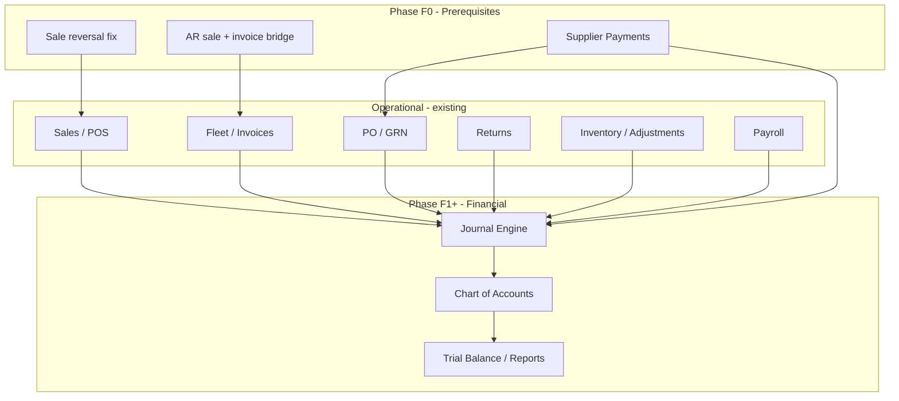

# Financial Module — Groundwork & Roadmap

**Project:** DayByDay Automotive  
**Module:** Financial / General Ledger (new)  
**Status:** Groundwork — decisions recorded; pre-requisites before build  
**Last updated:** 2026-06-20

---

## 1. Purpose

This document maps every operational module that touches money today, records **accounting policy decisions** needed before building COA / journal entries / ledgers / trial balance, and defines a **pre-finance roadmap** so known gaps are closed (or explicitly deferred) before the GL layer is added.

**Design principle:** Operational modules remain the source of truth for business events. The financial module listens to those events (via a central posting service) and writes **balanced journal entries** to a general ledger. The existing `stock_ledger` is an **inventory subledger** (quantity + unit cost) — it is **not** the GL.

**Out of scope for this groundwork doc:** full COA numbering scheme, UI wireframes, migration scripts — those follow in a finance design spec once pre-requisites are done.

---

## 2. Terminology

| Term | Meaning in this system |
|------|------------------------|
| **GL** | General ledger — `chart_of_accounts`, `journal_entries`, `journal_lines` (to be built) |
| **Stock ledger** | `stock_ledger` — append-only inventory movement log with `unit_cost`; feeds COGS and inventory asset |
| **Subledger** | Operational detail that rolls up to a GL control account (AR, AP, inventory) |
| **COA** | Chart of accounts |
| **GRN** | Goods receipt note — posts inventory at cost via `purchase_receipt` |
| **GRNI** | Goods received not invoiced — interim liability between receipt and supplier invoice (hybrid policy) |
| **AR** | Accounts receivable — fleet/credit customer balances |
| **AP** | Accounts payable — amounts owed to suppliers |
| **COGS** | Cost of goods sold — derived from `unit_cost` on sale ledger lines |
| **Posting event** | A business moment that should generate (or reverse) journal lines |

---

## 3. Current state

### 3.1 What exists today

| Layer | Tables / modules | Role |
|-------|------------------|------|
| **Retail revenue** | `sales`, `sale_items`, `payments` | POS checkout, tax, payment methods |
| **Credit / AR (implicit)** | `sales` (credit), `customer_accounts` | Outstanding balance via `payment_status` |
| **Billing** | `customer_invoices`, `customer_invoice_payments` | Period statements + settlement |
| **Refunds** | `returns`, `return_items` | Customer refunds; fleet balance adjustment |
| **Procurement cost** | `quotation_series`, `quotation_items` | Planning, landing cost, margins |
| **Purchase commitment** | `purchase_orders`, `purchase_order_items` | PO totals, receipt progress |
| **Inventory receipt** | `goods_receipt_notes`, `goods_receipt_note_items` | Capitalize stock at `unit_cost` |
| **Supplier returns** | `returns` (type supplier) | Reduce inventory at cost |
| **Inventory** | `stock_ledger`, `stock_balances` | Qty + weighted average cost |
| **Adjustments** | `stock_adjustments` | Count variances |
| **Transfers** | `transfer_requests`, `stock_transfers` | Inter-location moves at cost |
| **Payroll** | `payroll_periods`, `payroll_runs`, `payroll_lines` | Gross, statutory deductions, net pay |
| **Reports** | `FinancialReportQuery`, etc. | Aggregates operational data — **not** trial balance |

### 3.2 What does not exist

- Chart of accounts
- Journal entries / journal lines
- General ledger balances or trial balance
- Supplier payment / AP settlement workflow
- Bank account master or reconciliation
- Tax remittance workflow
- Formal AR/AP control accounts (balances are computed from operational tables)

---

## 4. Decision register (approved)

These policies were confirmed via product poll before finance build starts.

| # | Topic | Decision | Implication |
|---|--------|----------|-------------|
| D1 | **Purchase recognition** | **Hybrid** — GRN capitalizes inventory + separate AP for invoice matching & payment | Build **Supplier Payments** before core finance; GRN posts inventory; AP tracks supplier liability; payment clears AP |
| D2 | **AR recognition** | **Both** — provisional AR at credit sale; adjusted/consolidated at invoice | Credit sale creates initial AR journal; invoice generation posts consolidation/adjustment entries (not billing-only) |
| D3 | **Supplier payments** | **Build before finance** | New module: pay against PO/GRN, supplier statements — prerequisite Phase F0 |
| D4 | **Cash / bank COA** | **Matrix: payment method × shop** | e.g. `Cash — Shop A`, `M-Pesa — Shop B`; journal lines carry `shop_id` + `payment_method` dimensions |
| D5 | **Sale reversal** | **Fix in Sales before finance** | Reverse payments + refund workflow in `SaleService`; do not rely on manual journals alone |
| D6 | **Tax (VAT)** | **VAT Payable + remittance tracking** | Separate liability account; sales tax collected → VAT payable; remittance workflow in finance phase |
| D7 | **Payroll GL** | **Accrue on lock; clear on mark paid** | Lock: Dr salary expense, Cr deductions payable + net wages payable; Pay: Dr payables, Cr bank |

---

## 5. Pre-finance roadmap (close gaps first)

These items **must** be on the product roadmap **before or in parallel with** Phase F1 (core GL). They implement the decisions above.

### Phase F0 — Prerequisites (operational)

| ID | Item | Why | Touches |
|----|------|-----|---------|
| F0.1 | **Supplier Payments module** | No way to pay suppliers today; D1 + D3 require AP settlement | New: `supplier_payments`, link to PO/GRN/supplier; permissions, UI, service |
| F0.2 | **Sale reversal — payment reversal** | D5 — `SaleService::reverse()` restocks stock but does not reverse `payments` | `SaleService`, `Payment`, refund/cash-drawer rules |
| F0.3 | **Credit sale → invoice AR bridge** | D2 — document & implement dual AR posting hooks | `SaleService::completeOnAccount`, `CustomerInvoiceService::generate` |
| F0.4 | **Shop × payment method dimension** | D4 — ensure all payment records carry `shop_id` consistently | `payments`, `customer_invoice_payments`; validate on complete/checkout |
| F0.5 | **Tax remittance placeholder** | D6 — config + status fields for VAT periods (even if UI is v2) | `config/sales.php`, optional `tax_remittances` table stub |

### Phase F1 — Core financial module

| ID | Item | Description | Status |
|----|------|-------------|--------|
| F1.1 | COA master | Account types, hierarchy, active flag, normal balance | Done |
| F1.2 | Journal entry engine | Double-entry, balanced lines, `reference_type` / `reference_id` polymorph | Done |
| F1.3 | Posting service | `AccountingService::post(Event)` called from operational services | Done (service ready; F2 wires events) |
| F1.4 | Account ledger / trial balance | Per-account activity, period balances, TB report | Done |
| F1.5 | Manual journals | Admin-adjusting entries with approval (reuse approval engine pattern) | Done |

### Phase F2 — Automated posting (by priority)

See §7 for event list. Roll out P0 first, then P1, P2.

| ID | Item | Status |
|----|------|--------|
| F2.0 | `GlPostingService` + `config('finance.auto_posting')` | Done |
| F2.1 | P0: retail sale, credit sale, GRN receive, customer return | Done |
| F2.2 | P1: invoice payment, sale reversal, GRN void, stock adjustment, payroll lock/pay, supplier payment | Done |
| F2.3 | Invoice generate GL (D2 no-op — AR at sale) | Skipped by design |
| F2.4 | P2: supplier return, stock transfer reclass | Done |
| F2.5 | PO closed short | Skipped — GRNI accrues at GRN only (D1); no GL impact |

### Phase F3 — Finance UI & compliance

| ID | Item | Status |
|----|------|--------|
| F3.1 | VAT remittance workflow (file/remit/mark paid) | Done |
| F3.2 | Bank reconciliation | Done |
| F3.3 | Financial statements (P&L, balance sheet) from GL | Done |
| F3.4 | Period close / lock | Done |

---

## 6. Modules that involve money or transactions

### 6.1 Tier 1 — Direct revenue, cash, receivables, payables

#### Sales & POS (`Sale`, `SaleItem`, `Payment`)

**Routes:** `sales.*`, `receipts.show`  
**Service:** `SaleService`

| Event | Method | Financial fields |
|-------|--------|------------------|
| Hold order | `hold()` | None — stock reserved only |
| Complete (retail) | `complete()` | `subtotal`, `tax_total`, `total`; `Payment` rows by method |
| Issue on account | `completeOnAccount()` | `total` → AR; `payment_status = unpaid` |
| Reverse | `reverse()` | Restock at cost — **payment reversal required (F0.2)** |
| Abandon held | `abandonHeld()` | Release reservation only |

**Posting hooks (future):** retail sale, credit sale, reversal, COGS/inventory from `stock_ledger` `sale` lines.

---

#### Fleet / customer accounts (`CustomerAccount`)

**Routes:** `customer-accounts.*`  
**Logic:** `outstandingBalance()` = unpaid credit sales − completed return refunds

Implicit AR subledger today. Formal GL control account **Accounts Receivable — Fleet** with subledger by `customer_account_id`.

---

#### Customer invoices (`CustomerInvoice`, `CustomerInvoicePayment`)

**Routes:** `customer-invoices.*`  
**Service:** `CustomerInvoiceService`

| Event | Method | Financial fields |
|-------|--------|------------------|
| Generate invoice | `generate()` | Rolls up sales: `subtotal`, `tax_total`, `total` |
| Record payment | `recordPayment()` | `CustomerInvoicePayment`; updates `amount_paid` |

**Posting hooks (D2):** provisional AR at sale + consolidation/adjustment at invoice; payment clears AR to cash (method × shop).

---

#### Customer returns (`ReturnRecord`, `ReturnItem`)

**Routes:** `customer-returns.*`  
**Service:** `ReturnService::process()` (on approval)

| Impact | Detail |
|--------|--------|
| Refund | `refund_amount`; reduces fleet outstanding |
| Restock | `customer_return` on `stock_ledger` if good condition |

**Posting hooks:** sales returns, AR/cash credit, optional inventory/COGS reversal.

---

#### Procurement chain

**Quotation series** (`QuotationSeries`, `QuotationItem`) — planning costs; **no GL** until PO/GRN unless budget/commitment reporting is added later.

**Purchase orders** (`PurchaseOrder`) — commitment; hybrid model may use for open PO / GRNI tracking.

**Goods receipts** (`GoodsReceiptNote`) — **`GoodsReceiptService::receive()`** capitalizes inventory (`purchase_receipt`); **`void()`** reverses.

**Supplier returns** — inventory out at cost; supplier credit note linkage via future AP module.

---

#### Payroll (`PayrollPeriod`, `PayrollRun`, `PayrollLine`)

**Routes:** `payroll.*`, `employees.*`  
**Service:** `PayrollService`

| Event | GL moment (D7) |
|-------|----------------|
| Generate run | Calculation only |
| **Lock** | **Accrue** expense + statutory liabilities |
| **Mark paid** | **Clear** liabilities to bank |

---

### 6.2 Tier 2 — Inventory & COGS (not cash, but GL-critical)

**Service:** `InventoryService` — all stock movements.

| `stock_ledger.transaction_type` | Source | GL impact |
|--------------------------------|--------|-----------|
| `opening_balance` | Setup | Inventory asset |
| `purchase_receipt` | GRN | Inventory ↑ (Dr Inventory / Cr GRNI or AP) |
| `purchase_receipt_void` | GRN void | Reverse receipt |
| `sale` | Sale / reversal | COGS ↔ Inventory |
| `customer_return` | Customer return | Inventory ↑ if restocked |
| `supplier_return` | Supplier return | Inventory ↓ |
| `transfer_in` / `transfer_out` | Transfers | Reclass by location dimension |
| `adjustment` | Stock adjustment | Inventory vs shrinkage/expense |

`FinancialReportQuery` already sums inventory value from `stock_balances` for management reporting.

---

### 6.3 Tier 3 — Master data (indirect)

| Module | Financial relevance |
|--------|---------------------|
| Products | `cost_price`, min/max selling price; cost synced from stock |
| Suppliers | `currency`, `purchase_type` (local/import) |
| Shops / Warehouses | Dimensions for revenue, inventory, cash matrix |
| Tax config | `config('sales.tax_rate')` |

---

### 6.4 Tier 4 — Reporting only (not GL)

| Report | Service |
|--------|---------|
| Financial summary | `FinancialReportQuery` |
| Sales | `SalesReportQuery` |
| Procurement | `ProcurementReportQuery` |
| Inventory | `InventoryReportQuery` |

These read operational tables directly. Post-finance, reports should reconcile to trial balance.

---

## 7. Posting events catalogue

Priority for automated journals when `AccountingService` is built.

### P0 — Must have in finance v1

| Event | Source | Service method | Typical journal pattern |
|-------|--------|----------------|-------------------------|
| Retail sale completed | Sales | `SaleService::complete` | Dr Cash (method×shop) / Cr Revenue, Cr VAT payable; Dr COGS / Cr Inventory |
| Credit sale completed | Sales | `SaleService::completeOnAccount` | Dr AR / Cr Revenue, Cr VAT; Dr COGS / Cr Inventory |
| GRN posted | Procurement | `GoodsReceiptService::receive` | Dr Inventory / Cr GRNI or AP |
| Customer return completed | Returns | `ReturnService::process` (customer) | Dr Sales returns / Cr AR or Cash; optional inventory reversal |

### P1 — High priority

| Event | Source | Service method |
|-------|--------|----------------|
| Invoice payment received | Fleet | `CustomerInvoiceService::recordPayment` |
| Invoice generated (AR consolidation) | Fleet | `CustomerInvoiceService::generate` |
| Sale reversed | Sales | `SaleService::reverse` (after F0.2) |
| GRN voided | Procurement | `GoodsReceiptService::void` |
| Stock adjustment approved | Inventory | `InventoryService::postAdjustment` |
| Payroll locked | Payroll | `PayrollService::lock` |
| Payroll paid | Payroll | `PayrollService::markPaid` |
| Supplier payment made | Supplier Payments | *F0.1 — to be built* |

### P2 — Later

| Event | Source |
|-------|--------|
| Supplier return completed | `ReturnService::process` (supplier) |
| PO closed short | `GoodsReceiptService::closePurchaseOrderShort` |
| Transfers | `TransferService` (dimension reclass; often no P&L) |

---

## 8. COA skeleton (draft)

Account numbering TBD. Structure reflects decisions D4 (method × shop) and D6 (VAT).

### Assets

| Code (draft) | Name | Notes |
|--------------|------|-------|
| 1xxx | Cash on hand — {Shop} — {Method} | Matrix per D4 |
| 11xx | Bank accounts | If distinct from till cash |
| 12xx | Accounts receivable — fleet | Control; subledger = `customer_accounts` |
| 13xx | Inventory — warehouse | Optional split by warehouse |
| 13xx | Inventory — shops | Optional split by shop |
| 14xx | GRNI / goods in transit | Hybrid purchase (D1) |

### Liabilities

| Code (draft) | Name | Notes |
|--------------|------|-------|
| 21xx | Accounts payable — suppliers | Control; subledger = suppliers |
| 22xx | VAT payable | D6 — collected on sales |
| 23xx | PAYE payable | Payroll |
| 23xx | NSSF payable (employee + employer) | Payroll |
| 23xx | SHIF payable | Payroll |
| 23xx | Housing levy payable | Payroll |
| 24xx | Net wages payable | Accrued on payroll lock |

### Revenue & COGS

| Code (draft) | Name |
|--------------|------|
| 4xxx | Sales revenue — parts |
| 49xx | Sales returns & allowances |
| 5xxx | Cost of goods sold |

### Expenses

| Code (draft) | Name |
|--------------|------|
| 6xxx | Salaries & wages |
| 6xxx | Employer statutory contributions |
| 6xxx | Inventory shrinkage / adjustments |

---

## 9. Architecture sketch

```
┌─────────────────────┐     posting event      ┌──────────────────────┐
│ Operational module  │ ────────────────────▶  │ AccountingService    │
│ (Sale, GRN, etc.)   │                        │ post(Event $payload) │
└─────────────────────┘                        └──────────┬───────────┘
                                                            │
                    ┌───────────────────────────────────────┼────────────────────────┐
                    ▼                                       ▼                        ▼
           ┌────────────────┐                    ┌─────────────────┐      ┌──────────────┐
           │ journal_entries │                    │ journal_lines    │      │ COA balances │
           │ (header, date,  │                    │ account, debit,  │      │ trial balance│
           │  reference)     │                    │ credit, dims     │      │              │
           └────────────────┘                    └─────────────────┘      └──────────────┘

Parallel subledgers (existing):
  stock_ledger  → inventory qty/cost (COGS source)
  sales + payments + invoices  → AR/cash detail until fully on GL
  PO + GRN + supplier_payments (F0.1)  → AP detail
```

**Integration pattern:** Mirror `InventoryService::record()` — one atomic DB transaction: operational write first, then journal lines, with idempotency key per source document + event type to prevent duplicate posting.

---

## 10. Module dependency graph



---

## 11. Open questions (for finance design spec)

| # | Question | Notes |
|---|----------|-------|
| Q1 | Fiscal year / period structure? | Calendar month vs 4-4-5 vs Kenya FY |
| Q2 | Multi-currency GL? | Import POs in USD; functional currency KES? |
| Q3 | Per-shop P&L or company-wide only? | D4 implies shop dimension on lines |
| Q4 | Approval on manual journals? | Reuse `Approval` engine like stock adjustments |
| Q5 | Idempotency on repost after failure? | Event key = `{model}:{id}:{event}` |
| Q6 | GRNI vs AP on GRN — always GRNI first? | Hybrid D1 — confirm with accountant |

---

## 12. Related documents

| Document | Relationship |
|----------|--------------|
| `docs/build-roadmap.md` | Overall module order — add Phase F0/F1 here |
| `docs/procurement-quotation-spec.md` | Landing cost → PO → GRN cost basis |
| `docs/database-erd.md` | Extend with `chart_of_accounts`, `journal_*` when designed |

---

## 13. Summary checklist before coding finance

- [x] **F0.1** Supplier Payments module scoped and built
- [x] **F0.2** Sale reversal reverses payments / refunds
- [x] **F0.3** AR at sale + invoice consolidation documented in services
- [x] **F0.4** Payments always scoped to `shop_id` + `method`
- [x] **F0.5** VAT remittance data model agreed
- [x] COA draft reviewed with accountant
- [x] Posting event catalogue signed off (§7)
- [x] `AccountingService` interface + idempotency rules written
- [x] Phase F1 migrations + permissions in `RoleSeeder`

---

*Decision poll completed 2026-06-20. Update this document when policies change or F0 items are delivered.*
